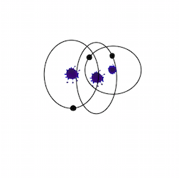

#For what can the digital algorithm might be used? 

After i had a second look at my results i had the idea to use this to generate Logos for a company. Every employee gets his own logo wich can be used for example for business cards or other print products. For this i needed to reduce my code an leave as much away as possible.

