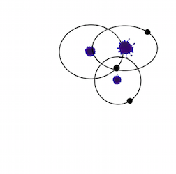
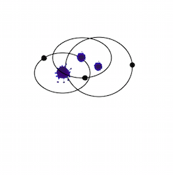
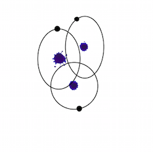
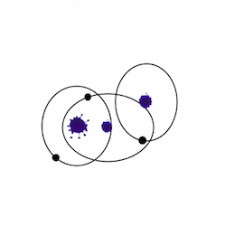
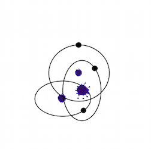

#For what can the digital algorithm might be used? 

After i had a second look at my results i had the idea to use this to generate Logos for a fictional company. For this i needed to reduce my code to bring more clearence in the generated image. Every employee gets his own logo wich can be used for example for business cards or other print products. In this way every employee can choose his individual logo by clicking the play button as long as he finds the right one.
Here are some of an endless amount of examples: 

#Installation
You need to download processing to put this code into execution https://processing.org/download/

# Usage
You copy the folder **data** and **GenerativesLogo.pyde** to your desktop and open the file with processing.
I wrote this code in Python so it`s necessairy to choose python in the upper righthand corner and click the run button.

 

